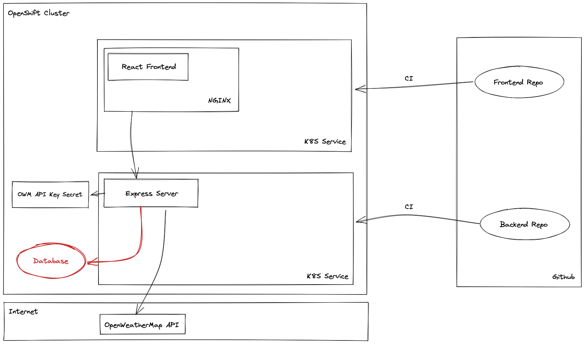

# Weather App (Backend)

## Architecture

See the graphics below for an architecture overview:



## Developing

Backend: Run `OWM_API_KEY=CHANGE_ME npm start` and replace `CHANGE_ME` with your [OpenWeatherMap API key](https://openweathermap.org/api)
Frontend: Run `npm start`

**Make sure to run the backend first or start the React developing server on another port**

## Deploy

Before you `oc apply -f tekton/base` for each repository (frontend and backend) you'll have to create following Secrets on your own.
Replace the values in `<angled brackets>`:

```
apiVersion: v1
kind: Secret
metadata:
  name: git-credentials
type: kubernetes.io/basic-auth
stringData:
  username: <Github User Name>
  password: <Personal Access Toke>
---
apiVersion: v1
kind: Secret
metadata:
  name: robot-secret
data:
  .dockerconfigjson: <Quay.io Robot Secret Config>
type: kubernetes.io/dockerconfigjson
---
apiVersion: v1
kind: Secret
metadata:
  name: api-keys
  type: Opaque
data:
  owm: <Base64 Encoded OWM Api Key>
```

After that you can either run `oc create -f backend.PipelineRun.yml` (or `frontend.PipelineRun.yml`)
or use the created VCS build trigger routes as webhook inside your forked repositories.
